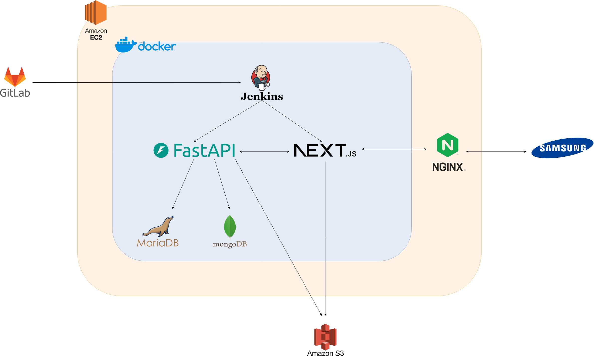
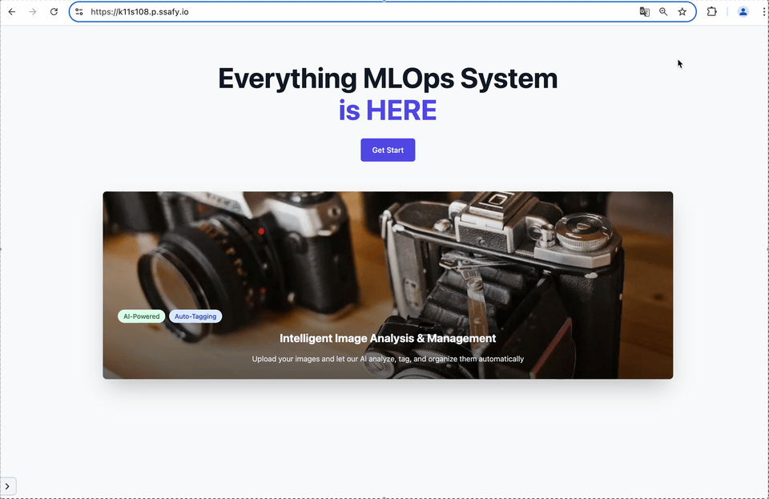
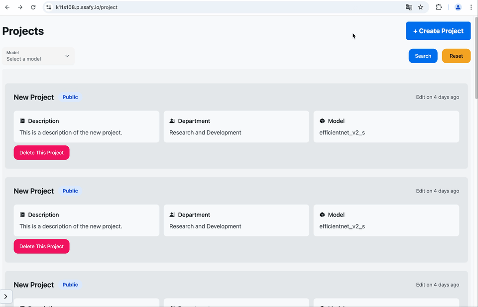
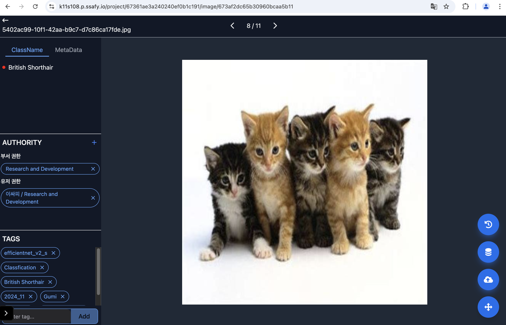

# 🌟 삼성 청년 SW 아카데미 11기 S108(DATAG) 🌟


# 🌳 프로젝트 개요

지속 가능한 Vision AI 모델 운영을 위해서는 끊임없이 새로운 데이터가 수집되고 정제되어 모델 재학습으로 이어져야 한다.
과거에는 데이터가 부족한 점이 문제였다면 이제는 많은 데이터 중에서 분석을 통해 보다 의미있는 데이터를 선별하여 효과적인 학습을 진행하는 것이 중요해졌다.
이를 위해 수집된 원시 데이터(Raw Data)로부터 유의미한 Feature를 추출하고 분석을 위해 시각화 하는 것이 필요하다.

# 목표

- 데이터 업로드 → **Metadata 생성(AI 모델 추론 결과 필요)** →이미지의 Feature Vector 추출 (Feature Extractor AI 모델 필요)
  → Feature 차원 축소(t-SNE, UMAP) → 시각화 (2D or 3D)
- Metadata, Multiple Tag 활용을 통한 데이터 검색 기능 개발
  . Metadata는 일반적인 데이터 검색 (Date, AI Model Prediction 등의 검색 조건)
  . Tag는 개별 이미지 데이터에 자유롭게 부여, 삭제 하고 Only Tag를 이용하여 검색 (단 tags 조합 시 AND, OR 조건 조합)
- Feature 분석을 통한 모델 재학습 기준 수립
  . Feature는 AI Model 에서 추출한 float array(Vector) 데이터
  . 고차원이므로 시각화를 위해 2~3차원으로 축소 필요
  . 시각화된 Feature에서 outlier를 확인하고 필요한 데이터를 선택적으로 조회하는 기능 필요

### ✨ 팀원

|  팀장  |  팀원  |  팀원  |  팀원  |  팀원  |  팀원  |
| :----: | :----: | :----: | :----: | :----: | :----: |
| 황병현 | 최현성 | 김호경 | 김경대 | 정재훈 | 최지훈 |

### 📅 기간

- 기획 및 설계 : 2024.10.14 - 2024.10.18
- 개발 : 2024.10.21 - 2024.11.19

# 💎 소개

### 🌃 기획 의도

Vision AI는 컴퓨터가 이미지를 인식하고 해석할 수 있게 하는 기술입니다.  
사람은 눈과 뇌를 통해서 이미지를 보고 무엇이 있는지를 인식하듯이  
컴퓨터는 이 기술을 이용해서 이미지를 분석합니다.

MLOps는 머신 러닝 자동 학습을 위한 파이프라인 구축 플랫폼 같은 것이며
머신러닝 모델을 실제 서비스에 안정적으로 적용하고 관리하는 방법론입니다.

저희는 이러한 것을 조합하여, 사용자에게 데이터를 받아서 자동으로 분석을 하여, Vision AI학습에 적합한 데이터를 선정하는 것을 목표를 두고 있습니다.

즉 저희 프로젝트의 목표는 Vision AI MLOps 구축을 위한 데이터 분석 플랫폼 개발이 목표입니다.
다만 완전한 자동화가 아닌, 사용자가 이미지들을 올리면 자동으로 분석을 하고, 해당 분석을 통한  
MLOps 구축하는 것입니다.

### 🔍 주요 기능

- 사용자에게 학습시킬 이미지 및 추가적인 데이터(MetaData, Feature 등)을 업로드 할 수 있으며, 반대로 이에 대한 분석 결과를 다운로드 할 수 있습니다.

- 이미지들에 대한 AI의 분석을 거치면 다차원 벡터(행렬)에 대한 값(Feature들)을 얻을 수 있으며, 그것들을 축소시켜서 2, 3차원으로 시각화가 가능합니다.

- 각 이미지마다 출처, 생성 시각, 모델 정보, 추론 결과 등에 대한 태그를 부여를 직접 할 수 있습니다.

- Vision 검사결과에 대해 다양한 옵션(AND, OR, NOT)으로 검색이 가능할 수 있습니다.

### 🌃 타겟층

AI를 통해서 불량을 검증하는 모든 제조업 및 공장을 타겟으로 잡고 있습니다.

# 🔨 Tech Stack 🔨

### Front End


### Back End


### DB


### Infra


### Team Collaboration Tools


### Architecture



# 🌍 서비스 기능

## 🎯 회원

### 이메일 인증 시스템 회원가입


### 자동 로그인



유효한 RefreshToken이 남아 있을 경우, 자동적으로 로그인 되도록 처리했습니다.

## 🎯 핵심 기능

(순서대로)

### 프로젝트 생성


프로젝트를 생성합니다.
여기서 다음과 같은 설정을 할 수 있습니다.

1. 모델 선택
2. 이름 및 설명
3. 공개 범위 설정

### 이미지 업로드



여러장에 대한 이미지 업로드.
추가적으로 zip 파일도 지원합니다.

### 이미지 태그 처리



각 이미지가 업로드가 되면, 서버에서 먼저 해당 이미지에 대해서
자동적으로 분석이 이루어집니다.

따라서 사용자는 미리 해당 이미지에 대한 여러가지 정보 및 메타 데이터들을 볼 수 있으며, 직접 수정도 가능합니다.

또한 각 이미지의 접근권한도 설정 할 수 있습니다.

### 분석


여러장에 대한 이미지를 (최소 10장이상) 선택하여 분석을 하면,  
각각 이미지들에 대한 Feature를 계산하여, 이를 Graph로 표현해 줍니다.

사용자를 이를 통해서 각각 이미지에 대한 특성을 확인할 수 있습니다.

# 🔆 기술

## 🖥️ Front End

### MiddleWare 및 쿠키를 이용한 접속&Fetch 제어

해당 프로젝트에서 핵심적인 기능에 대한 부분은 접근 권한이 매우 중요합니다.
Next.js 에서는 접속 할 때 Cookie에 담긴 정보를 이용해서 빠르게 접근을 제한 할 수 있습니다.

Cookie에는 유효시간이 매우 짧은 AccessToken, 그나마 긴 RefreshToken을 활용하여,
해당 AccessToken이 유효한지, 혹은 유효하지 않더라도 RefreshToken을 통해서 자동으로 토큰 재발급을 시도합니다.

해당 작업은 Next.js 에서 페이지 접속, Server Action, Route handler 등에 자동적으로 Middleware라는 곳을 거치며, 이를 이용해서 자동적으로 Authorization이 처리됩니다.

### 자동 로그인

처음 접속 할 때 refreshToken을 이용한 자동 로그인을 지원합니다.
이 또한 RefreshToken을 활용하여, 재 발급을 시도하며, 재 발급이 성공하면 그 즉시 로그인이 되도록 해 줍니다.

또한 유저 정보에 대한 호출은 Redux-toolkit의 thunk를 활용하여  
첫 접속시 바로 유저를 불러 올 수 있도록 하였습니다.

## 🖥️ Back End

### Classification & Object Detection

대량의 이미지를 분류하고 탐지하는 것은 시간을 오래 쓰는 일입니다.
AI를 활용하여 대량의 이미지를 분류하고 탐지하면 시간을 절약할 수 있습니다.

AI Server를 분리하여 Classification 모델 3개, Object Detection 모델 3개를 각 pre-traning시켜 weight를 부여하였습니다. 출력값 이전에 hook을 하여 각 이미지의 feature를 추출하고 Mongodb에 저장하였습니다.

해당 작업은 추출된 feature를 사용하여 API Server에서 차원축소를 진행하여 사용자에게 시각화 정보를 제공합니다.
<br>
<br>
<br>
<br>

# 실행 환경 구축 및 실행 방법
[포팅 메뉴얼](exec/README.md)
# MariaDB 세팅

- table생성 외 세팅은 없습니다.

```
# users
CREATE TABLE `users` (
	`user_id` INT(11) NOT NULL AUTO_INCREMENT,
	`name` VARCHAR(255) NOT NULL COLLATE 'utf8mb4_bin',
	`email` VARCHAR(255) NOT NULL COLLATE 'utf8mb4_bin',
	`password` VARCHAR(255) NOT NULL COLLATE 'utf8mb4_bin',
	`duty` VARCHAR(255) NOT NULL COLLATE 'utf8mb4_bin',
	`location` VARCHAR(255) NOT NULL COLLATE 'utf8mb4_bin',
	`department_id` INT(11) NULL DEFAULT NULL,
	`is_supervised` TINYINT(4) NOT NULL,
	`created_at` TIMESTAMP NOT NULL,
	`updated_at` TIMESTAMP NOT NULL,
	PRIMARY KEY (`user_id`) USING BTREE,
	UNIQUE INDEX `email` (`email`) USING BTREE,
	INDEX `fk_users_department` (`department_id`) USING BTREE,
	CONSTRAINT `fk_users_department` FOREIGN KEY (`department_id`) REFERENCES `departments` (`department_id`) ON UPDATE RESTRICT ON DELETE SET NULL
)

# departments
CREATE TABLE `departments` (
	`department_id` INT(11) NOT NULL AUTO_INCREMENT,
	`department_name` VARCHAR(255) NOT NULL COLLATE 'utf8mb4_unicode_ci',
	PRIMARY KEY (`department_id`) USING BTREE
)
```

# DB 덤프 파일 최신본

## MariaDB

[MariaDB](exec/S108.sql)

## MongoDB

- [project](exec/S11P31S108.projects.json)
- [feature](exec/S11P31S108.features.json)
- [metadata](exec/S11P31S108.metadata.json)
- [images](exec/S11P31S108.images.json)
- [history](exec/S11P31S108.histories.json)
- [imagelabel](exec/S11P31S108.imageLabels.json)
- [image_models](exec/S11P31S108.imageModels.json)
- [image_permissions](exec/S11P31S108.imagePermissions.json)
- [project_history](exec/S11P31S108.projectHistories.json)
- [project_image](exec/S11P31S108.projectImages.json)
- [project_permission](exec/S11P31S108.projectPermissions.json)
- [tag_image](exec/S11P31S108.tagImages.json)
- [upload_batches](exec/S11P31S108.uploadBatches.json)
- [user_upload_batches](exec/S11P31S108.userUploadBatches.json)

# Back End(API) 실행 방법

## 1. **BE 디렉토리로 이동**

- 아래 명령어를 사용하여 BE 디렉토리로 이동합니다:
  ```bash
  cd BE/app
  ```

## 2. 라이브러리 설치

- 아래 명령어를 사용하여 필요한 라이브러리를 설치합니다.
  ```bash
  pip install requirements.txt
  ```

## 3. BE 서버 실행

- uvicorn을 사용하여 BE 서버를 실행합니다:
  ```bash
  uvicorn main:app --reload
  ```

# Back End(DL) 실행 방법

## 1. **DL 디렉토리로 이동**

- 아래 명령어를 사용하여 DL 디렉토리로 이동합니다:
  ```bash
  cd DL/app
  ```

## 2. 라이브러리 설치

- 아래 명령어를 사용하여 필요한 라이브러리를 설치합니다.
  ```bash
  pip install requirements.txt
  ```

## 3. DL 서버 실행

- uvicorn을 사용하여 DL 서버를 실행합니다:
  ```bash
  python main.py
  ```
- python명령어를 통해 8081 port로 실행(port 충돌 방지)
- [DL서버 호출](BE/app/services/project/upload_service.py)코드 수정 필요(193줄)

# FE local 실행 방법

1. **Node.js** 설치 필요

[Node.js](https://nodejs.org/en) 파일을 설치 (LTS)

> Mac OS 환경에서는 Homebrew를 통한 설치를 권합합니다. [블로그설명](https://memostack.tistory.com/274)

2. FE 프로젝트 디렉토리로 이동. 해당 프로젝트 경로에서 VSCode 실행

3. 다음 명령어 실행 하여 라이브러리 설치 : `npm install`

4. 환경설정 변수 설정 : fe 폴더 디렉토리 바로 하위 경로에 `.env.local` 파일을 추가하여 다음과 같은 값을 설정합니다.

```
NEXT_PUBLIC_BACKEND_URL=백엔드 서버 API.
NEXT_PUBLIC_FRONTEND_URL=프론트 서버 URL (로컬인 경우 http://localhost:3000 )

```

**주의점** : 백엔드 서버 API는 엔드포인트 전까지 전부 작성해야 합니다. 마지막 부분엔 슬래시를 넣지 않습니다.  
Ex : `http://localhost:8000/be/api`

5. 환경에 따른 실행

   - 개발자 모드에서 실행 : `npm run dev`

   - 배포 모드에서 실행 : `npm run build` 후 성공적일 경우 `npm run start`

   - SSR 동작을 지원하므로, 코드를 수정할 일이 없을 경우. 빌드 후 실행을 추천합니다

   - 중요 : 사전에 환경설정된 백엔드 서버가 정상적으로 동작해야 합니다. 동작하지 않는 경우 build가 이루어지지 않습니다.

# env 파일 구조

```
MARIA_USER=maria_user_name
MARIA_PASSWORD=maria_password
MARIA_HOST=maria_host
MARIA_PORT=maria_port
MARIA_DATABASE=maria_database
MONGO_URL=mongo_url
ADMINISTRATOR_EMAIL=administrator_email
SMTP_HOST=smtp_host
SMTP_PORT=stmp_port
SMTP_PASSWORD=stmp_password
REDIS_HOST=redis_host
REDIS_PORT=redis_port
REDIS_PASSWORD=redis_password
S3_ACCESS_KEY=aws_s3_access_key
S3_SECRET_ACCESS_KEY=aws_s3_secret_access_key
S3_REGION_NAME=aws_s3_region_name
JWT_SECRET_KEY=jwt_secret_key
TEST_MONGO_URL=test_mongodb_url
```

# requirement 파일

[BE requirement.txt(API 서버)](BE/app/requirements.txt)

[DL requirement.txt(Deeplearning 서버)](DL/app/requirements.txt)
